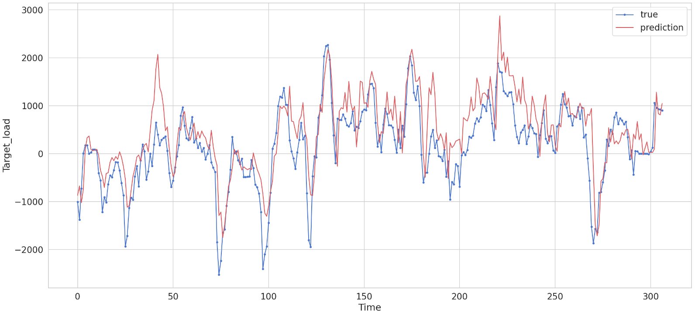

# Price Forecasting and System Direction Determination in the Balancing Power Market
[](https://opensource.org/licenses/MIT)


As we approach real-time, we want to develop a model that accurately forecasts the price formed in the
equilibrium market based on the conditions of a particular day and day-ahead market forecasts.
This project aims to develop balance, price, and demand forecasting models focusing on renewable energy sources. While also examining the day-ahead electricity generation and the output of these renewable energy sources by considering the changeable weather conditions.

**We will be tackling this problem as a time series analysis forecasting.**


## Installation
### Git Clone
Git clone the repository by running the following commands:
```bash
# change directory to Documents
cd Documents
git clone https://github.com/TahaBinhuraib/energy_datascience.git
cd energy_datascience
```
### Anaconda
You need to install [Anaconda](https://www.anaconda.com/products/distribution), then run below:
```bash
conda create --name energy python=3.8
conda activate energy
pip install -r requirements.txt
```

## Usage
### Jupyter Notebooks
* [EDA](EDA.ipynb) Exploratory data analysis
* [Pytoch-LSTM](lstm.ipynb)
* [Keras-LSTM](keras_bidirectional_lstm.ipynb)
* [Up-counts](up_counts.ipynb) Balance market direction

### Python :snake:
You can run our python deep and machine learning model by running the following:
```bash
cd src
# Machine learning algorithms
python ml_algorithm.py
# PyTorch LSTM
python run_lstm.py
```
